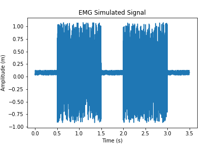
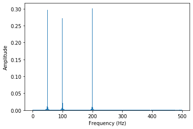
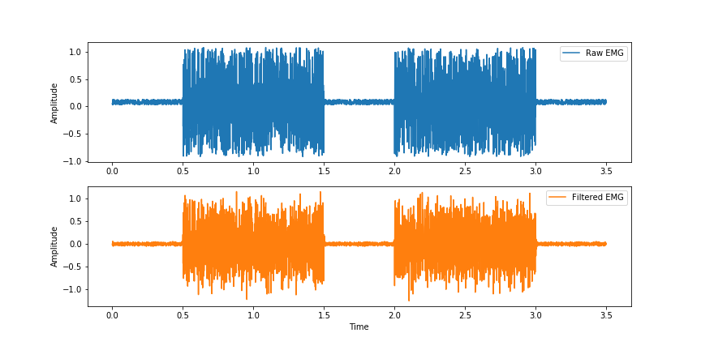
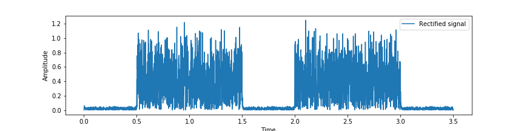
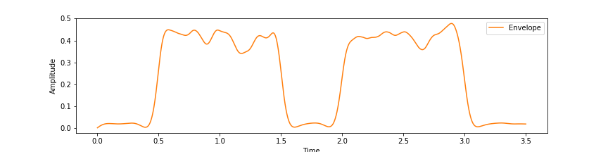

# <center>  BioProc  </center>
<center>By Praveen Prabhakar KR</center>

---
<center> </center>
<p style="text-align: right;"> Image from:<a href="https://hackaday.io/project/113338-publys-an-open-source-biosensing-board/log/143756-emg-sensor"> http://ataspinar.com/2018/04/04/machine-learning-with-signal-processing-techniques/ </a></p>

---
# Overview

Bioproc is a signal processing library based in Python for biological data.


 - ##### EMG
 - ##### ECG
 - ##### EEG

---
# Highlights

1. Signal processing essentials - filtering, frequency, power analysis, etc.
2. Signal processing essentials for EMG - find onsets, normalize EMG, etc.
3. Classification of healthy and diseased individuals using biological data by ANN - upcoming.


---
# Testing

Tests can be run with 'pytest -v' in the 'bioproc' module.

---
# Examples


```python
import bioproc.functions as fn
import bioproc.emg as em
import matplotlib.pyplot as plt

#generate EMG signals
emg = em.emgsig(seed=100, plot='Yes')
```




```python
#generate sine wave
sine = fn.sinewave(freq=100,fs=1000,plot='No') + fn.sinewave(freq=200,fs=1000,plot='No') + fn.sinewave(freq=50,fs=1000,plot='No')

#zero padding
sine_pad = fn.padding(sine,6384) #zeros calculated by padsize function

#FFT 
fourier = fn.fft(sine_pad, fs=1000)
```




```python
#filtering
filt_emg = fn.iir(emg,plot='No')

#plotting
plt.figure(figsize=(12,6))
t = np.arange(0,3.5,1/1000)
plt.subplot(211)
plt.plot(t, emg, label="Raw EMG")
plt.ylabel("Amplitude")
plt.legend()
plt.subplot(212)
plt.plot(t,filt_emg, c='#ff7f0e',label="Filtered EMG")
plt.legend()
plt.xlabel("Time")
plt.ylabel("Amplitude")
```




```python
#rectify EMG
rect_emg = fn.rectify(filt_emg)
```




```python
#linear envelope
linenv = fn.envelope(rect_emg)
```



---
# Dependencies

- matplotlib
- numpy
- autopep8
- scipy
- pylint
- pytest
- pdoc3
- pip
- biosppy
- scikit-learn
- keras
- tensorflow
- wfdb

---
# Citations

1. Carreiras C, Alves AP, Lourenço A, Canento F, Silva H, Fred A, et al. BioSPPy - Biosignal Processing in Python, 2015-, https://github.com/PIA-Group/BioSPPy/ [Online; accessed 2020-04-06.

2. Www1.udel.edu. 2020. [online] Available at: <https://www1.udel.edu/biology/rosewc/kaap686/notes/EMG%20analysis.pdf> [Accessed 25 April 2020].

3. Micera, S., Sabatini, A. M., Dario, P., & Rossi, B. (1999). A hybrid approach to EMG pattern analysis for classification of arm movements using statistical and fuzzy techniques. Medical Engineering & Physics, 21(5), 303–311. https://doi.org/10.1016/S1350-4533(99)00055-7

4. Pattichis, C. S., Schizas, C. N., & Middleton, L. T. (1995). Neural network models in EMG diagnosis. IEEE Transactions on Biomedical Engineering, 42(5), 486–496. https://doi.org/10.1109/10.376153

5. Abel, E. W., Zacharia, P. C., Forster, A., & Farrow, T. L. (1996). Neural network analysis of the EMG interference pattern. Medical Engineering & Physics, 18(1), 12–17. https://doi.org/10.1016/1350-4533(95)00032-1

