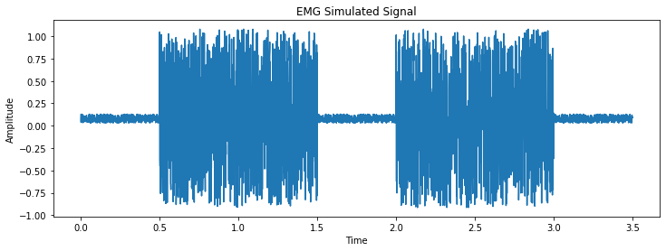

# <center>  Bioproc  </center>
<center>By Praveen Prabhakar KR</center>

---
<center> </center>
<p style="text-align: right;"> Image from:<a href="https://hackaday.io/project/113338-publys-an-open-source-biosensing-board/log/143756-emg-sensor"> http://ataspinar.com/2018/04/04/machine-learning-with-signal-processing-techniques/ </a></p>

---
# Overview

Bioproc is a signal processing library based in Python for processing biological data.


 - ##### EMG
 - ##### ECG
 - ##### EEG

---
# Highlights

1. Signal processing essentials - filtering, frequency, power analysis.
2. Classification of healthy and diseased individuals using biological data by ANN.


---
# Examples


```python
import bioproc.functions as fn
import matplotlib.pyplot as plt
import numpy as np

#generate EMG signals
emg = fn.emgsig(seed=100, plot='Yes')
```




```python
#generate sine wave
sine = fn.sinewave(freq=100,fs=1000,plot='No') + fn.sinewave(freq=200,fs=1000,plot='No') + fn.sinewave(freq=50,fs=1000,plot='No')

#zero padding
sine_pad = fn.padding(sine,6384) #zeros calculated by padsize function

#FFT 
fourier = fn.fft(sine_pad, fs=1000)
```


```python
#filtering
filt_emg = fn.iir(emg,plot='No')

#plotting
plt.figure(figsize=(12,6))
t = np.arange(0,3.5,1/1000)
plt.subplot(211)
plt.plot(t, emg, label="Raw EMG")
plt.ylabel("Amplitude")
plt.legend()
plt.subplot(212)
plt.plot(t,filt_emg, c='#ff7f0e',label="Filtered EMG")
plt.legend()
plt.xlabel("Time")
plt.ylabel("Amplitude")
```


```python
#rectify EMG
rect_emg = fn.rectify(filt_emg)
```


```python
#linear envelope
linenv = fn.envelope(rect_emg)
```


---
# Dependencies

- matplotlib
- numpy
- autopep8
- scipy
- pylint
- pytest
- pdoc3
- pip
- biosppy
- scikit-learn
- keras
- tensorflow

---
# Citations

1. Carreiras C, Alves AP, Lourenço A, Canento F, Silva H, Fred A, et al. BioSPPy - Biosignal Processing in Python, 2015-, https://github.com/PIA-Group/BioSPPy/ [Online; accessed 2020-04-06.
